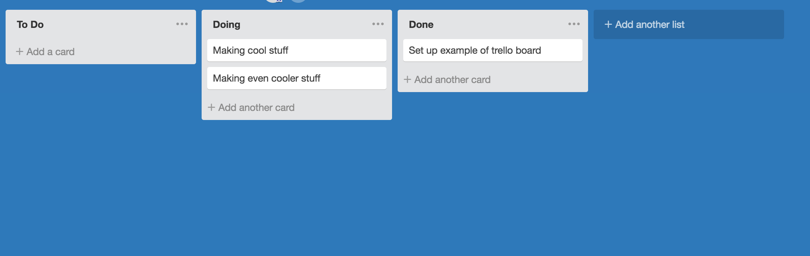

## Instructions

You are being asked to implement a Drag and Drop Note Page.  Something in the design of [Trello](https://trello.com/b/jNPTiiVB/untitled-board). 

This project is a chance to show off your skills.  There are no specific requirements just a general outline of what to create.  You are not expected to complete all of the features and extra credit.  Please do not spend more than 8 hours on the project.

Features are up to you but could include things such as:
* add list
* remove list
* add card
* edit card
* remove card
* card descriptions
* drag card to new list
* attach image to card
* set card due date
* responsive design

## Getting Started

To get started fork this repository and create feature branches.  The repository already has a starter [create react app](https://github.com/facebook/create-react-app) project you can work with.  Make sure to make frequent and detailed commits.  Once you finish make a detailed pull request and send an email to Dylan@geniusplaza.com.

*[Good Git Flow](https://www.atlassian.com/git/tutorials/comparing-workflows/gitflow-workflow)*

## Focus

This project is open ended but things to focus on include:

* Clean bug/error free code - a good way to avoid bug free code is through well thought out planning before implementation
* File Structure/Management
* Good and Latest React Practices - We stay up on the latest in the React/Javascript community here.  Showing that you do the same can be beneficial.
* Unit Testing - Either TDD/BDD are appreciated
* README - Your code should include a README describing the general implementation, outline for future use of any reusable components/functions, and the build process if required.

<!-- *Focus first on creating a replica of the existing About Us page meeting these criteria.  After that you can implement any additional features to really show off your skills.* -->

## Extra Credit

If you have some time left over feel free to take a stab at the extra credit

* There's mock signup and login endpoints in server.js.  Run `node server` and make your requests in application/json format to localhost:5000 to encorporate a login and signup page.
	- /signup
		- request body: {
			username,
			password
		}
		- response: {
			success: true
		}
	-	/login
		- request body: {
			username,
			password
		}
		- response: {
			token
		}
* Create endpoints in server.js to save and retrieve your board progress.  Make sure to send along your auth token to incorporate different boards for different users.  Feel free to design the data in whatever way you see fit.
* Add SASS or LESS support

<!-- *There is no need to create a separate application, you can implement routing or any other mechanism you're familiar with to incorporate both projects in the repo* -->
